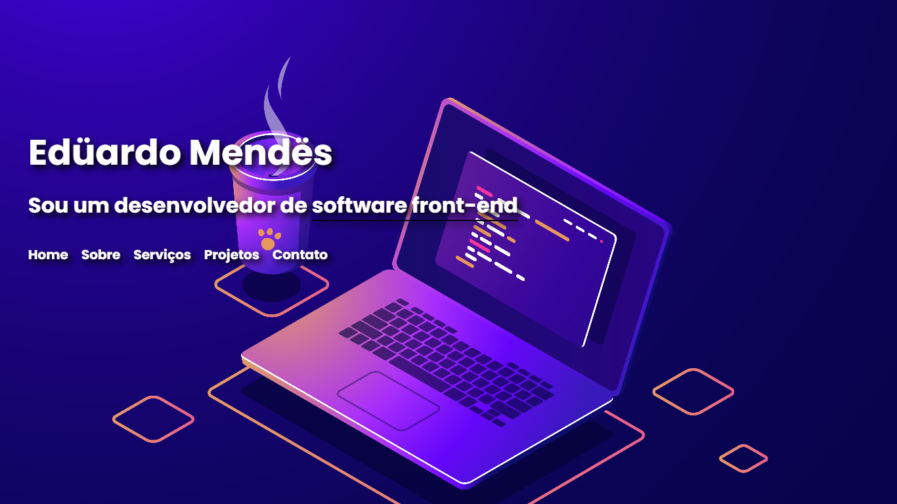

<h1 align="center"> Meu Portfólio Frontend </h1>

Bem-vindo ao meu portfólio Frontend! Aqui estão alguns dos meus projetos mais interessantes e desafiadores que desenvolvi ao longo da minha carreira como desenvolvedor Frontend. Este portfólio é um reflexo da minha paixão pelo desenvolvimento de software e minha busca constante por aprender e aprimorar minhas habilidades.

## 🚀 Tecnologias utilizadas

 

- HTML5
- CSS3
- JavaScript
- React
- Sass
- Vite
- Git
- GitHub
- Vercel
- VS Code

 

## Preview

  

## 💻 Sobre mim

Meu nome é Eduardo Mendes e sou um desenvolvedor Frontend apaixonado por tecnologia. Tenho experiência em desenvolvimento de aplicativos da web usando tecnologias como React, Javascript, Nodejs, Typescript, HTML, CSS e SASS.

Espero que gostem do portfólio e fiquem à vontade para entrar em contato comigo.

 

## Licença

Este projeto é licenciado sob a licença MIT. [Licença](https://opensource.org/licenses/MIT) para mais informações.

 

## Referências 

Projeto disponibilizados atraves do [Frontend Mentor](https://www.frontendmentor.io/) e da [Alura](https://www.alura.com.br/)

Imagem de fundo Desenvolvido por [fullvector / Freepik](http://www.freepik.com)

Imagem disponibilizada pelo [Gifer](https://gifer.com/pt/Ao)

ícones utilixados pelo site [React Icons](https://react-icons.github.io/react-icons)
